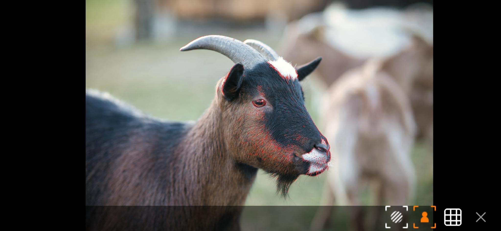
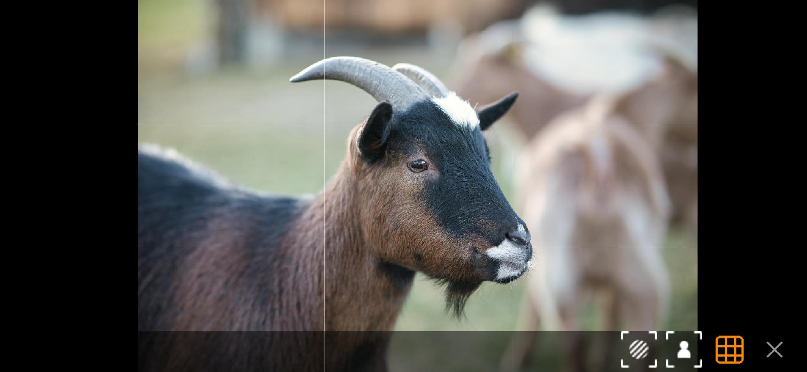

# NdiMonitor

Android App to view an [NDI®](http://ndi.tv/)-Stream on an Android mobile phone.

## Features

### Video Sources

- **Full NDI® Monitoring**
    - Supports full NDI® sources (⚠️ NDI® HX is **not** supported).
    - The following color formats (FourCC) are supported:
        - **BGRA** (32-bit, 8 bits per channel with Alpha)
        - **UYVY** (16-bit, 8 bits per channel - no Alpha)
        - **RGBA** (32-bit, 8 bits per channel with Alpha)
    - Since NDI® can be network-intensive, using a **USB-C Ethernet adapter** is strongly recommended.

- **UVC HDMI Capture Cards**  
  The app can capture video from **UVC-compatible devices**, such as USB HDMI capture cards.  
  This functionality was developed and tested with a low-cost **UGREEN Video Capture Card** (Amazon), which performed
  reliably.  
  Any supported UVC device will automatically appear as an available source.

---

## Monitoring Tools

### Focus Peaking

- Simple focus peaking implementation
- Fixed sharpness sensitivity: **70%**

---

### Zebra

- Exposure warning using zebra stripes
- Fixed threshold: **95 IRE**

---

### Grid Overlay

- **3×3 composition grid** for framing assistance

## Build Requirements

Before building, we need to make sure that the following components are installed:

- Java Development Kit (JDK) 11
- Android SDK Platform 33
- NDI SDK for Android

### 1. Java 11

This project must be built with Java 11. Newer Java versions (e.g. Java 17) may cause Gradle or NDK build failures.
The reason is, that this project should be runnable on older phones. Android SDK Platform Level 33 uses Java 11.

### 2. Android SDK

Install Android SDK Platform 33. Instruction can be
found [here](https://developer.android.com/about/versions/13/setup-sdk)

### 3. Download and Install the NDI SDK

Download the NDI SDK for Android from the [official site](https://ndi.video/for-developers/ndi-sdk/download/)

Follow the installer instructions for your platform and note the installation directory.

### 3.1 Copy NDI Header Files

After installation, copy the NDI header files into the project’s C++ include directory:

`cp <NDI_SDK_INSTALL_DIR>/NDI\ SDK\ for\ Android/include/* \ <PROJECT_ROOT>/NdiMonitor/app/src/main/cpp/include/`

### 3.2 Copy NDI Library Binaries

Next, copy the NDI library binaries into the project’s jniLibs directory:

`cp <NDI_SDK_INSTALL_DIR>/NDI\ SDK\ for\ Android/lib/* <PROJECT_ROOT>/NdiMonitor/app/src/main/jniLibs/`

Ensure that the copied libraries match the ABIs you intend to build for (e.g. arm64-v8a, armeabi-v7a).

### 4. Build the Project

`./gradlew assemble`

## State of this project

This app is in a very early development phase. Therefore it is not fully tested. It is possible that the app does not
work stable and that there are some ui or- performance glitches.

## License

NDI® is a registered trademark of the Vizrt Group. Also visit http://ndi.video for details.

This project is licensed under the APACHE License 2.0. See included [LICENSE](LICENSE) file.
